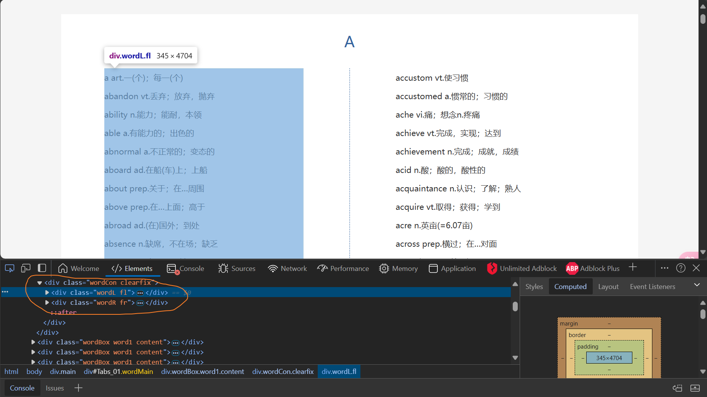

# 用python爬取英语4级单词-hinter的单词来源

### 第一个python文件:

```python
import requests
import re
from bs4 import BeautifulSoup
import words_operation
import data_operation

# 爬取单词
# 目标网页URL
url = "https://www.eol.cn/html/en/cetwords/cet4.shtml"

# 发送GET请求
response = requests.get(url)
response.raise_for_status()  # 确保请求成功

# 使用BeautifulSoup解析网页内容
soup = BeautifulSoup(response.content.decode(), 'html.parser')
word_soup = soup.find('div', class_='main')

# 处理提取的单词，例如打印或保存到文件
num_write = 0
words = []
repeat_words = []

with open('dictionary.txt', 'w', encoding='utf - 8') as file:
    for p_element in word_soup.findAll('p'):
        text = p_element.get_text().strip()
        if not text.strip():  # 跳过空行
            continue
        # 用正则表达式提取单词
        word = re.findall(r'\b\w+\b', text)
        # 防止重复的单词写入
        print(word)
        if word[0] in words:
            repeat_words.append(word[0])
            continue
        num_write += 1
        words.append(word[0])

        file.write(f'{text}\n')

print("写入的行数:", num_write) # 实际上并不匹配
print(repeat_words)
print(f'重复的单词有{len(repeat_words)}个') # 实际上并不匹配

# 这里不知道为什么打印的行数和写出的行数不匹配,写入的行数还是有重复的单词,所以写了remove_repeat_word去重


# txt文本操作
words_operation.remove_repeat_word()
words_operation.find_mistakes('cet4-words.txt')


```

### 第二个python文件:

```python
import re

# 去重
def remove_repeat_word():
    all_words = []
    repeat_words = []
    with (open('dictionary.txt', 'rt', encoding='utf8') as file_read,
          open('cet4-words.txt', 'wt', encoding='utf8') as file_write):
        # 读取所有行

        for line in file_read:
            # 跳过空行
            line = line.strip()
            if not line:
                continue
            # 匹配单词
            word = re.findall(r'\b\w+\b', line)
            # 排查重复单词
            if word[0] in all_words:
                repeat_words.append(word[0])
                continue
            all_words.append(word[0])
            file_write.write(line+'\n')

    print(repeat_words)
    print(f'重复的单词有{len(repeat_words)}个')

# 由于爬取的网站个别单词开头是缺单词的,需要找出不完整的单词手动修改,这里可能有点难理解,可以先运行get-words,再运行reduplication,
# 再运行这个程序,去new.txt里找到对应行数就能明白了
# 不完整的单词分别是assport(应该为passport,少了p)ension(p后面多了空格)ecite(应该为recite,少了r)
# 运行完后需要手动修改,这个程序只是打印可能不完整的单词

# 通过上一轮循环单词的首字母和这轮循环单词首字母的ASCII码值进行比较
def find_mistakes(file_path):
    with open(file_path, 'r', encoding='utf-8') as file:
        previous_letter = 'a'
        line_number = 0
        for line in file:
            line_number += 1
            word = line.strip()
            current_letter = word[0].lower()
            if current_letter < previous_letter:
                print(f"可能不完整的单词{line_number}: '{word}'")
            previous_letter = current_letter


```

### 第三个python文件:

```python
import sqlite3

# 创建数据库及单词表
def create_database():
	with sqlite3.connect("database.db") as conn:
		cursor = conn.cursor()
		# 创建单词表
		cursor.execute("""
			CREATE TABLE IF NOT EXISTS dictionary(
				id INTEGER PRIMARY KEY AUTOINCREMENT,
				word TEXT,
				paraphrase TEXT,
				isShow TEXT DEFAULT 'true',
				delete_button NULL
			);
		""")
# 添加单词和释义到单词表
def add_word():
	with sqlite3.connect('database.db') as conn, open('cet4-words.txt', 'rt', encoding='utf-8') as file:
		c = conn.cursor()
		# 添加单词和释义到单词表
		for line in file:
			word, paraphrase = line.strip().split(' ', 1)
			c.execute("INSERT INTO dictionary (word, paraphrase) VALUES (?, ?)", (word, paraphrase))


# 对单词进行排序(A-Z)
def sort_data():
	with sqlite3.connect("database.db") as conn:
		cursor = conn.cursor()
		# 创建单词表用于排序
		cursor.execute("""
	        CREATE TABLE IF NOT EXISTS sorted_table(
	            id INTEGER PRIMARY KEY AUTOINCREMENT,
	            word TEXT,
	            paraphrase TEXT,
	            isShow TEXT DEFAULT 'true',
	            delete_button NULL
	        );
	    """)
		# 从原单词表中插入数据到新单词表
		cursor.execute("""
	       INSERT INTO sorted_table(word, paraphrase)
	       SELECT word, paraphrase
	       FROM dictionary
	       ORDER BY LOWER(word) ASC;
	           """)
		# 删除原单词表
		cursor.execute("DROP TABLE dictionary;");
		# 把新单词表命名为原来的单词表
		cursor.execute("ALTER TABLE sorted_table RENAME TO dictionary;");


create_database()
add_word()
sort_data()
```

python版hinter:

```python
import sqlite3, random, time

with sqlite3.connect('database.db') as conn:
	c = conn.cursor()
	c.execute('select word,paraphrase from dictionary')
	words = c.fetchall()

	while True:
		rand = random.randint(0, len(words))
		print(f'\r{words[rand][0]}--------{words[rand][1]}', end='')
		time.sleep(1)


```

### 运行顺序:

3个python文件放在同一目录下,创建完前3个python文件后,先运行第一个python文件,由于网站的原因,需要根据控制台打印的信息手动修改有缺陷的单词(目前只有几个,并不多),再运行第三个python文件通过sqlite语句

```
ORDER BY LOWER(word) ASC
```

对表里的数据进行排序,因为网站里放单词的html元素是左右布局的,导致某段单词的首字母是不连续的(非A-Z,)所以需要对爬取的数据进行排序



手动修改有缺陷的数据和去重也是因为网站的缘故


