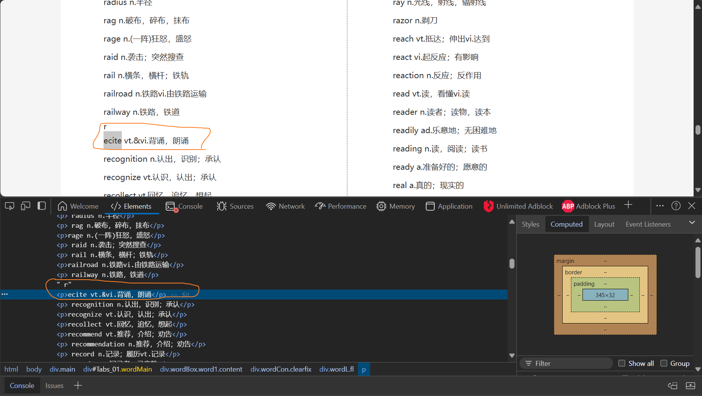
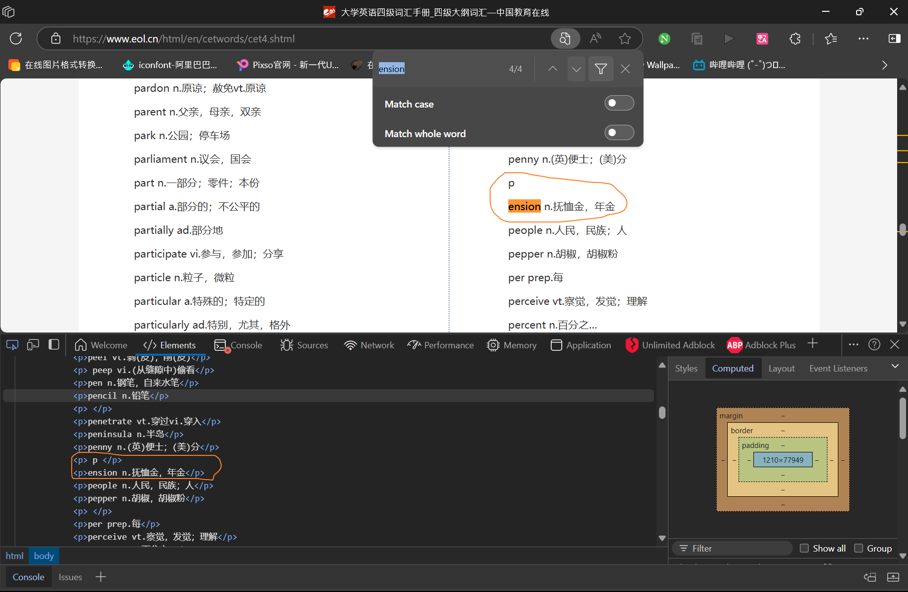
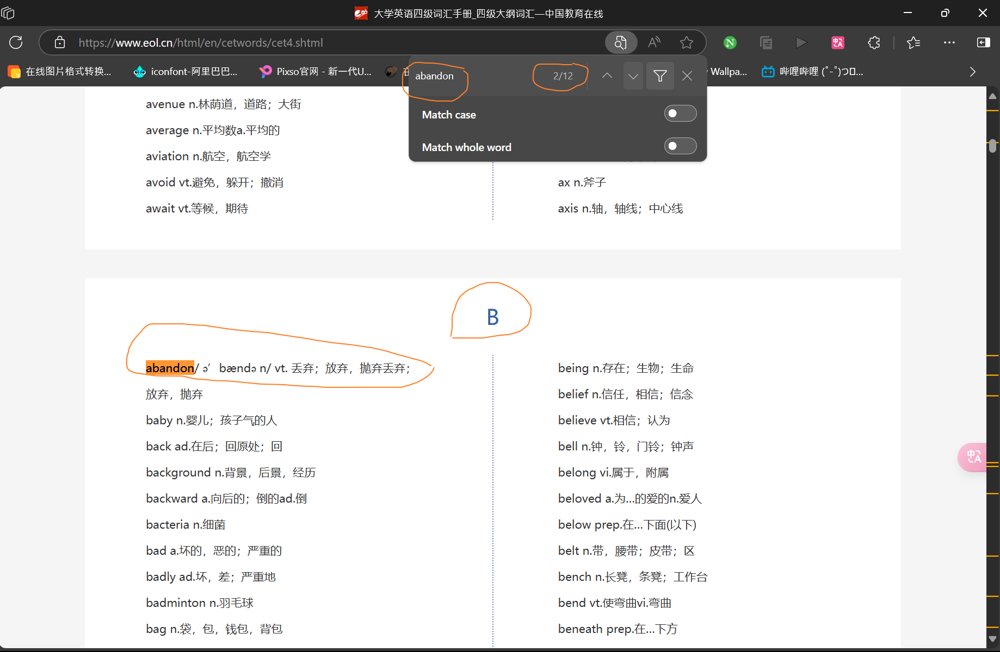

## 4级单词爬取程序

hinter里4级单词的数据是通过这些python代码爬取的

运行顺序:main.py - - -> data_operation.py

运行完main.py需要根据控制台打印的信息更改单词(也就几个),由于爬取的网站数据有缺陷,所以需要手动修改部分数据
(具体看main.py和words_operation.py里的注释)

不完整的单词

重复的单词

除了这些还有很多,就不一一举例了